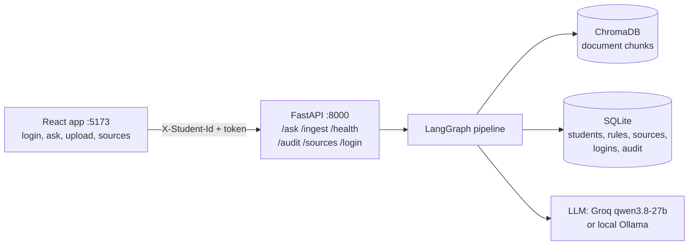
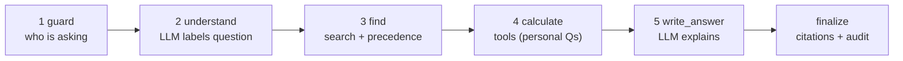

# UniSarthi: AI-Powered University Student Services Assistant

HCLTech Future Ready AI Engineer Hackathon · Team: Farhan, Manish, Nikita, Anish

A student asks a question. UniSarthi finds the rule in authorised university documents, checks the student's own records with plain code, and answers with the source cited. If it cannot find the answer, it says so.

## Architecture



Every question goes through the same steps:



Any step can stop early (refused, clarification_needed, not_found) and jump to finalize.

**The LLM is used twice: to understand the question and to explain the answer. Every decision is plain code**: who may see what, which rule wins (precedence policy), every calculation and eligibility result, the answer_type and the citations.

| Part | Choice | Why |
|---|---|---|
| UI | React + Vite | Simple single page: login, ask, upload, sources |
| API | FastAPI + Pydantic v2 | Required; Pydantic models are the API contract |
| Orchestration | LangGraph, one graph | Required; same steps for every question, so no extra agents |
| LLM | Groq `qwen/qwen3.8-27b`, or Ollama `qwen2.5:7b-instruct` | Fastest valid-JSON model we tested (0.17 s). One switch: `LLM_PROVIDER` |
| Embeddings | `all-MiniLM-L6-v2` | Beat bge-small on our eval (see Evaluation) |
| Vector store | ChromaDB, persisted | Required; no re-ingest on restart |
| Data | SQLite | Required; Annex C schema unchanged |

## Run it

```bash
# 1. Backend
cd backend
uv venv --python 3.11 .venv                    # or: python3.11 -m venv .venv
uv pip install --python .venv/bin/python -r requirements.txt
cp ../.env.example .env                        # fill in GROQ_API_KEY, SECRET_KEY, DEFAULT_STUDENT_PASSWORD
.venv/bin/python scripts/seed.py               # documents + rules + students + logins + ChromaDB
.venv/bin/uvicorn app.main:app --port 8000     # API docs: http://localhost:8000/docs

# 2. Frontend (new terminal)
cd frontend
cp .env.example .env
npm install && npm run dev                     # http://localhost:5173

# Or both with Docker (Ollama, if used, runs on the host)
docker compose up --build
```

Log in with any student ID S1001-S1032 and the `DEFAULT_STUDENT_PASSWORD` from `backend/.env`.

### Judges' data

```bash
cd backend
.venv/bin/python scripts/load_students.py --dir path/to/test_students/   # validates, then loads + creates logins
```

## Sample requests

```bash
# Policy question (no login needed)
curl -X POST localhost:8000/ask -H "Content-Type: application/json" \
  -d '{"question": "What is the minimum attendance required to appear in the end-semester exams?"}'

# Same question on an earlier date -> older rule, newer one shown as upcoming
curl -X POST localhost:8000/ask -H "Content-Type: application/json" \
  -d '{"question": "What is the minimum attendance required?", "as_of_date": "2026-07-15"}'

# Personal question (identity only from the header)
curl -X POST localhost:8000/ask -H "Content-Type: application/json" -H "X-Student-Id: S1018" \
  -d '{"question": "I failed Digital Electronics. If I pass the supplementary, will I be eligible for placement?"}'

# Live ingestion of a new document
curl -X POST localhost:8000/ingest -F "file=@new_circular.pdf" \
  -F 'metadata={"doc_id":"ACAD-2026-10","title":"Attendance circular","issuer":"Dean (Academics)","authority_level":2,"doc_type":"circular","version":"1.0","effective_from":"2026-10-01","supersedes":"ACAD-2026-08#1"}'

curl localhost:8000/audit/<trace_id>
curl localhost:8000/sources
curl localhost:8000/health
```

## Authentication

- `POST /login` checks the student ID and password (PBKDF2 hash with salt, never stored in plain text) and returns a token signed with `SECRET_KEY` (HMAC-SHA256, expires after `TOKEN_HOURS`).
- The React app sends `X-Student-Id` and `Authorization: Bearer <token>`. A token for a different student than `X-Student-Id` is rejected (403).
- `AUTH_REQUIRED=false` (default) keeps the guide's contract: the `X-Student-Id` header alone works, so judges' scripts run unchanged. Set it to `true` to require a token.
- Identity never comes from the question text. Questions about another student are refused.

## How conflicts are resolved (Annex A)

`backend/app/precedence.py`. **1** Applicability (in force on `as_of_date`, scope covers the student's programme and batch) → **2** explicit supersession by a level 1-2 document → **3** higher authority → **4** newer → **5** otherwise `conflict_flagged`, cite both. Level 5 (unofficial) never wins. Thresholds are read from `rule_registry` at every call. A new circular adds a new rule row and the policy decides.

## Evaluation

29 questions (`eval/questions.json`): 7 policy, 4 unanswerable, 4 version/conflict, 6 personal via tools, 3 other-student attempts, 3 multi-step / what-if, 1 clarification, 1 prompt injection. Method: automatic exact/keyword matching, no LLM judge (`eval/run_eval.py`).

| Metric | MiniLM (final) | bge-small |
|---|---|---|
| Answer correctness | 100% (29/29) | 97% (28/29) |
| Citation accuracy | 100% (20/20) | 100% (20/20) |
| Abstention accuracy | 100% | 100% |
| Tool-result correctness | 100% (9/9) | 100% (9/9) |
| Retrieval hit rate@k | 100% | 100% |
| Latency p50 / p95 | 7.3 s / 12.8 s | 11.3 s / 17.1 s |
| LLM calls / tokens per question | 1.59 / 1135 | 1.62 / 1314 |

Retrieval-only comparison (`eval/retrieval_comparison.md`): MiniLM hit@3 100%, MRR 0.74 vs bge-small hit@3 92%, MRR 0.72. MiniLM also separates answerable (top similarity ≥ 0.58) from unanswerable (≤ 0.47) questions more cleanly, so `MIN_SIMILARITY=0.50`.

**Before submission:** re-run `cd backend && .venv/bin/python ../eval/run_eval.py --label final --pause 8` (writes `eval/report_final.md`). The MiniLM numbers above are from our 6 Oct run; its report file was overwritten by a later run that hit the Groq free-tier limit (8,000 tokens/min), so it must be regenerated.

Honest notes: the threshold was tuned on this same question set, so unseen questions may score lower. Latency is dominated by Groq free-tier rate limiting when 29 questions run back to back; a single question in the UI usually takes 1-3 s.

## Assumptions

- The sample documents in `backend/data/docs` are stand-ins marked `synthetic: Y`. They must be replaced by our university's public documents (update `source_register.csv` and `rules_seed.csv` with the real clauses).
- Attendance and results in the synthetic data are for the semester that just ended.
- A what-if "if I pass the supplementary" assumes the CGPA stays the same (the new grade is unknown). A DETAINED course cannot be cleared by a supplementary exam.
- Rule extraction on live ingest only recognises parameters that already exist in the rule registry.

## Limitations and known edge cases

- No OCR: scanned PDFs without a text layer are rejected with a clear error.
- Section detection relies on numbered headings ("7.2 ...", "Q3 ..."); documents without numbering are cited by page only.
- Conflicts on topics without a registry rule are noticed by the LLM, but the winner is still chosen by code (authority, then date).
- If the LLM is unavailable, keyword rules and template answers are used, and the audit record shows `llm_fallback_used: true`.

## Repository map

See `docs/CONTRIBUTIONS.md` for who built which file. Other deliverables: `docs/DATA_CARD.md`, `docs/AI_USAGE.md`, `docs/sample_audits/` (4 audit records: retrieved_fact, calculated, refused, not_found), `eval/`.
