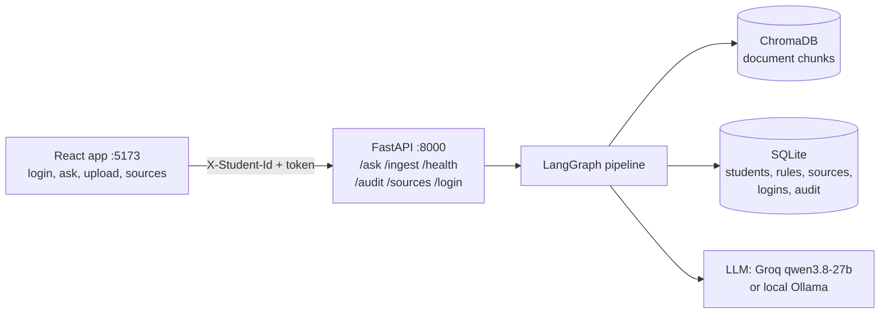
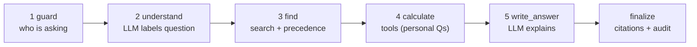

# UniSarthi: AI-Powered University Student Services Assistant

HCLTech Future Ready AI Engineer Hackathon · Team: Farhan, Manish, Nikita, Anish

A student asks a question. UniSarthi finds the rule in authorised university documents, checks the student's own records with plain code, and answers with the source cited. If it cannot find the answer, it says so.

## Architecture



Every question goes through the same steps:



Any step can stop early (refused, clarification_needed, not_found) and jump to finalize.

**The LLM is used twice: to understand the question and to explain the answer. Every decision is plain code**: who may see what, which rule wins (precedence policy), every calculation and eligibility result, the answer_type and the citations.

| Part | Choice | Why |
|---|---|---|
| UI | React + Vite | Simple single page: login, ask, upload, sources |
| API | FastAPI + Pydantic v2 | Required; Pydantic models are the API contract |
| Orchestration | LangGraph, one graph | Required; same steps for every question, so no extra agents |
| LLM | Groq `qwen/qwen3.8-27b`, or Ollama `qwen2.5:7b-instruct` | Fastest valid-JSON model we tested (0.17 s). One switch: `LLM_PROVIDER` |
| Embeddings | `all-MiniLM-L6-v2` | Beat bge-small on our eval (see Evaluation) |
| Vector store | ChromaDB, persisted | Required; no re-ingest on restart |
| Data | SQLite | Required; Annex C schema unchanged |

## Run it

```bash
# 1. Backend
cd backend
uv venv --python 3.11 .venv                    # or: python3.11 -m venv .venv
uv pip install --python .venv/bin/python -r requirements.txt
cp ../.env.example .env                        # fill in GROQ_API_KEY, SECRET_KEY, DEFAULT_STUDENT_PASSWORD
.venv/bin/python scripts/seed.py               # documents + rules + students + logins + ChromaDB
.venv/bin/uvicorn app.main:app --port 8000     # API docs: http://localhost:8000/docs

# 2. Frontend (new terminal)
cd frontend
cp .env.example .env
npm install && npm run dev                     # http://localhost:5173

# Or both with Docker (Ollama, if used, runs on the host)
docker compose up --build
```

Log in with a demo roll number (see `backend/data/students/students.csv`, e.g. `2024UCS3004`) and `DEFAULT_STUDENT_PASSWORD`, or create an account with an `@nsut.ac.in` email. Staff: `BOOTSTRAP_ADMIN_ID` / `BOOTSTRAP_ADMIN_PASSWORD`.

### Judges' data

```bash
cd backend
.venv/bin/python scripts/load_students.py --dir path/to/test_students/   # validates, then loads + creates logins
```

## Sample requests

```bash
# Policy question (no login needed)
curl -X POST localhost:8000/ask -H "Content-Type: application/json" \
  -d '{"question": "What is the minimum attendance required to appear in the end-semester exams?"}'

# Same question on an earlier date -> older rule, newer one shown as upcoming
curl -X POST localhost:8000/ask -H "Content-Type: application/json" \
  -d '{"question": "What is the minimum attendance required?", "as_of_date": "2026-07-15"}'

# Personal question (identity only from the header)
curl -X POST localhost:8000/ask -H "Content-Type: application/json" -H "X-Student-Id: S1018" \
  -d '{"question": "I failed Digital Electronics. If I pass the supplementary, will I be eligible for placement?"}'

# Live ingestion of a new document
curl -X POST localhost:8000/ingest -F "file=@new_circular.pdf" \
  -F 'metadata={"doc_id":"ACAD-2026-10","title":"Attendance circular","issuer":"Dean (Academics)","authority_level":2,"doc_type":"circular","version":"1.0","effective_from":"2026-10-01","supersedes":"ACAD-2026-08#1"}'

curl localhost:8000/audit/<trace_id>
curl localhost:8000/sources
curl localhost:8000/health
```

## Accounts and authentication

| Who | How |
|---|---|
| Student | Logs in with **roll number** (e.g. `2023UIT3015`) + password. Creates the account with the university email (`@nsut.ac.in`) and a 6-digit **email OTP**. "Forgot password" (OTP, new password) and "Forgot roll number" (emailed). Sees only the chat; the chat history is saved. |
| University staff | Separate **staff ID + password**. Adds documents (`/ingest`) and sees the Source Register. First staff account from `BOOTSTRAP_ADMIN_ID/PASSWORD` in `.env`, more with `python scripts/create_admin.py`. |

- **MongoDB** stores accounts (salted PBKDF2 password hashes), OTPs (hashed, expire after `OTP_MINUTES`, auto-deleted, max `OTP_MAX_ATTEMPTS` tries) and chat history. Student records and rules stay in **SQLite** (guide requirement). `roll_number` is an extra column on `students`; `student_id` (S####) is unchanged, so the judges' data and `X-Student-Id` header work as the guide says.
- **Email** is sent over SMTP (`SMTP_*` in `.env`) with Python's `smtplib`. `DEV_PRINT_OTP=true` prints OTPs in the server log when SMTP is not configured (development only).
- Tokens are signed with `SECRET_KEY` (HMAC-SHA256) and carry the role (`student` / `admin`). A student token for a different student than `X-Student-Id` is rejected (403); a student token cannot ingest documents.
- `AUTH_REQUIRED=false` and `INGEST_REQUIRES_ADMIN=false` keep the guide's open contract for the judges' scripts; set both to `true` in production.
- Demo accounts (no email) for all synthetic students: `CREATE_DEMO_ACCOUNTS=true` + `DEFAULT_STUDENT_PASSWORD`.

## How conflicts are resolved (Annex A)

`backend/app/precedence.py`. **1** Applicability (in force on `as_of_date`, scope covers the student's programme and batch) → **2** explicit supersession by a level 1-2 document → **3** higher authority → **4** newer → **5** otherwise `conflict_flagged`, cite both. Level 5 (unofficial) never wins. Thresholds are read from `rule_registry` at every call. A new circular adds a new rule row and the policy decides.

## Data

- **Documents:** 24 official NSUT documents (regulations, ordinances, circulars, notices, calendars, fee and hostel notices, placement policy), several of them scanned. Listed in `backend/data/source_register.csv` with provenance URLs; overview in `backend/data/POLICY_INDEX.md`.
- **Chunks:** 596 clause-aware chunks (PyMuPDF text, RapidOCR for scanned pages, xlsx rows) prepared by our document pipeline in the team data repo [anish295/HCL-Database](https://github.com/anish295/HCL-Database) and exported to `backend/data/chunks/nsut_chunks.jsonl`. `seed.py` loads them into ChromaDB with the same `all-MiniLM-L6-v2` model. New documents uploaded live go through `app/ingest.py`.
- **Rule registry:** 22 rules, each citing a document and clause (`backend/data/rules_seed.csv`).
- **Students:** 32 synthetic students (B.Tech IT / CSE, batches 2023 / 2024) with deliberate edge cases (`backend/data/students/`, `edge_cases.csv`, `docs/DATA_CARD.md`). Validated by `scripts/validate_data.py`.

## Evaluation

27 questions (`eval/questions.json`) on the NSUT corpus: 7 policy, 4 unanswerable, 3 version/conflict (incl. an expired placement policy), 6 personal via tools, 3 other-student attempts, 2 multi-step / what-if, 1 clarification, 1 prompt injection. Method: automatic exact/keyword matching, no LLM judge.

```bash
cd backend && .venv/bin/python ../eval/run_eval.py --label final --pause 8     # -> eval/report_final.md
.venv/bin/python ../eval/compare_retrieval.py                                 # embedding comparison
```

Results on the NSUT corpus (`eval/report_final.md`, Groq qwen3.8-27b, MiniLM, top-5):

| Metric | Result |
|---|---|
| Answer correctness | 96% (26/27) |
| Citation accuracy | 100% (14/14) |
| Abstention accuracy | 96% (26/27) |
| Tool-result correctness | 100% (9/9) |
| Retrieval hit rate@k | 100% (14/14) |
| LLM calls / tokens per question | 1.63 / 2642 |

The one miss (an off-topic cricket question answered with a friendly redirect instead of `not_found`) was fixed afterwards by narrowing the small-talk intent. Latency (p50 15 s) is dominated by the `--pause` and Groq free-tier rate limits; a single question in the UI takes a few seconds.

## Assumptions

- Student records are synthetic (no real student data); roll numbers follow the NSUT format but are invented.
- The 2024-25 placement policy is the latest public one and expired on 2025-06-30, so placement questions after that date are answered as "undetermined" with that reason.
- A what-if "if I clear course X" assumes the CGPA stays the same (the new grade is unknown).
- Rule extraction on live ingest only recognises parameters that already exist in the rule registry.

## Limitations and known edge cases

- Live `/ingest` has no OCR (scanned PDFs without a text layer are rejected); the shipped corpus was OCR'd by the data pipeline.
- Section detection relies on numbered headings ("7.2 ...", "Q3 ..."); documents without numbering are cited by page only.
- Conflicts on topics without a registry rule are noticed by the LLM, but the winner is still chosen by code (authority, then date).
- If the LLM is unavailable, keyword rules and template answers are used, and the audit record shows `llm_fallback_used: true`.

## Repository map

See `docs/CONTRIBUTIONS.md` for who built which file. Other deliverables: `docs/DATA_CARD.md`, `docs/AI_USAGE.md`, `docs/sample_audits/` (4 audit records: retrieved_fact, calculated, refused, not_found), `eval/`.
